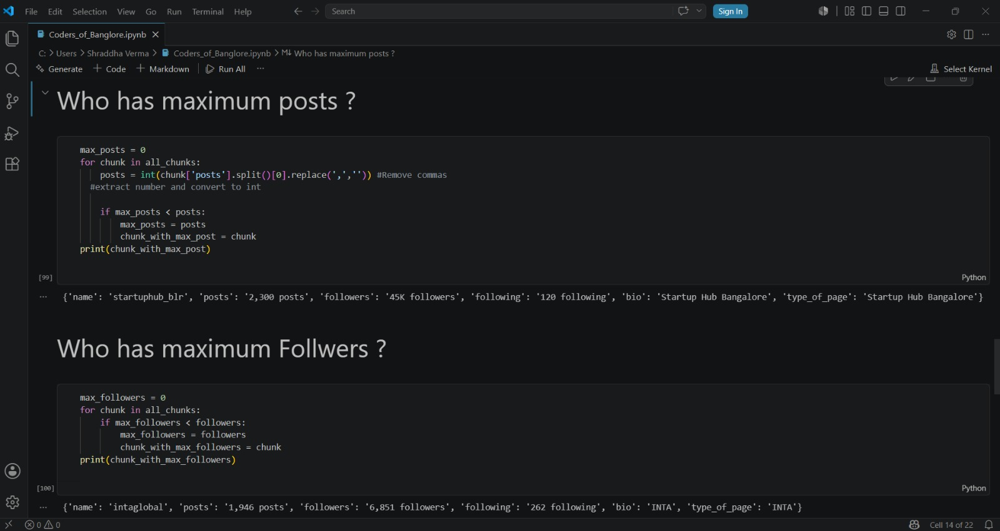
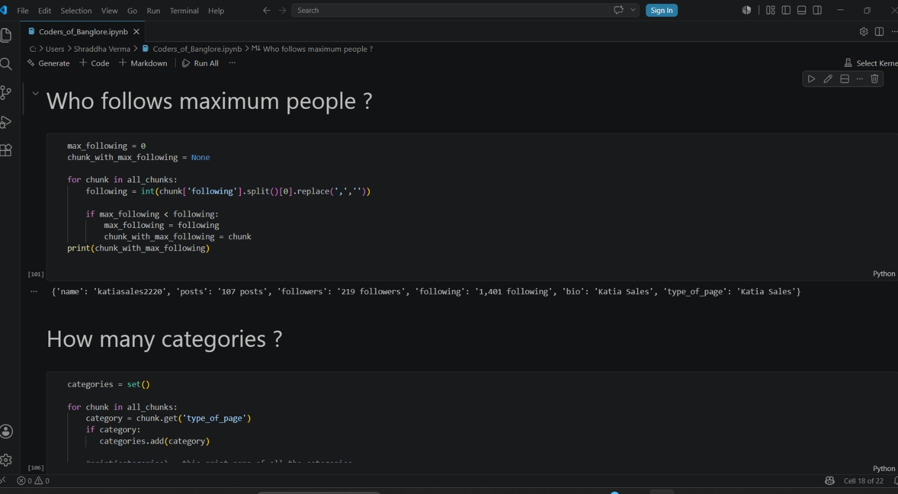
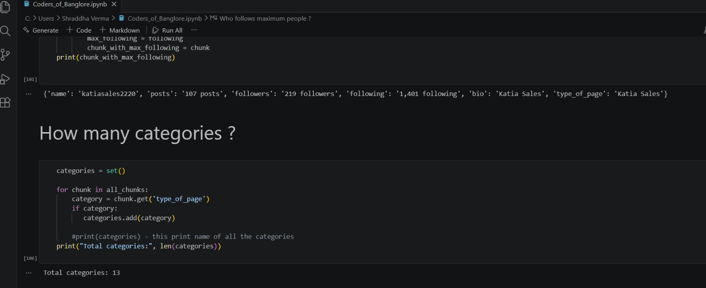

# Coders of Bangalore - Instagram Data Analysis

## Project Overview

This project was built using **pure Python** to analyze Instagram follower data and extract meaningful insights from raw social media data.

### Problem Statement

Imagine being given a dataset containing Instagram follower information and being asked to answer important questions about the users.

The objective is to clean the data, process it, and generate useful insights.

## Features

The project performs:

- Data Cleaning
- Data Preprocessing
- Finding the account with maximum posts
- Finding the account with maximum followers
- Finding the account following the maximum number of people
- Category-wise analysis
- Counting users in each category
- Generating summary statistics

## Questions Solved

- Who has the maximum posts?
- Who has the maximum followers?
- Who follows the maximum people?
- How many categories are present?
- How many users belong to each category?

## Key Insights Generated

- Identified the account with the maximum posts.
- Identified the account with the highest follower count.
- Identified the account following the maximum number of people.
- Calculated the total number of account categories.
- Analyzed category-wise user distribution.


## Skills Demonstrated

- Python Programming
- Data Cleaning
- Data Analysis
- Data Processing
- File Handling
- Problem Solving
- Exploratory Data Analysis

## Project Workflow

```text
Raw Instagram Data
        ↓
Data Cleaning
        ↓
Data Processing
        ↓
Data Analysis
        ↓
Insight Generation
        ↓
Results
```

## Screenshots

### Maximum Followers Analysis



### Maximum Following Analysis



### Category Analysis



## Project Structure

```text
Coders-of-Bangalore-Instagram-Analytics
│
├── README.md                     # Project documentation
├── LICENSE                       # MIT License
├── banner.png                    # Repository banner
├── maximum-followers.jpeg        # Output screenshot
├── maximum-following.jpeg        # Output screenshot
├── category-analysis.jpeg        # Output screenshot
└── Coders_of_Banglore.ipynb      # Main project notebook
```


## Author

**Shraddha Verma**

B.Tech Computer Science Engineering

Built as part of my Python learning journey to practice data cleaning, analysis, and insight generation using real-world social media data.
